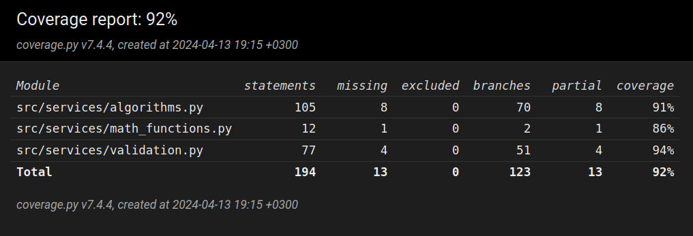

# Sovelluksen testaus

Sovelluksen käyttämät omatekemät matemaattiset funktiot ja Calculator- ja Validator-luokkien funktiot on testattu yksikkötesteillä hyödyntäen unittest-kirjastoa. Calculator-luokka on verrattaen monimutkainen, minkä vuoksi sitä testataan myös ns. päästä päähän. Tämä testaus tehdään aluksi yksinkertaisilla syötteillä ja myöhemmin testejä laajennetaan monimutkaisimmille syötteille. Sovelluksella on 13.4.2024 seuraava testikattavuus:

