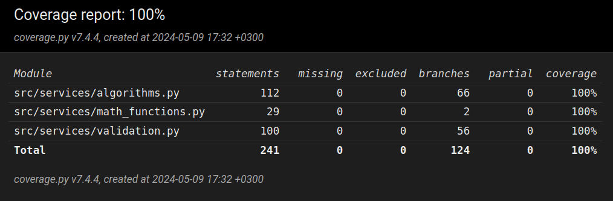

# Sovelluksen testaus

Sovelluksen käyttämät omatekemät matemaattiset funktiot ja Calculator- ja Validator-luokkien funktiot on testattu yksikkötesteillä hyödyntäen unittest-kirjastoa. Kyseisiä luokkia testataan sekä oikeellisilla että virheellisillä syötteillä. Funktioita testataan sekä yksinkertaisilla syötteillä, jotta funktioiden mahdollisesti sisältävät virheet olisi helppo tunnistaa, mutta myös monimutkaisilla syötteillä, jotka simuloivat paremmin sovelluksen käytössä saamia syötteitä. Käyttöliittymä on jätetty automaattisen testauksen ulkopuolelle, sillä käyttöliittymäohjelmointi ei ole kurssin ydinasiaa ja halusin keskittyä enemmän algoritmien kehittämiseen ja niiden testaamiseen. Sovelluksella on 9.5.2024 100 % testikattavuus:

Koska tieteellisen laskimen saamat syötteet ovat lähes aina melko lyhyitä, en kokenut tarpeelliseksi tehdä suorituskykyä mittaavia testejä sovellukselle. Tieteellisen laskimen toteutuksessa algoritmisia haasteita asettaa syötteen validointi, sillä syöte voi sisältää suuren määrän erilaisia virheitä ja niiden tunnistaminen on sovellukselle hankalahkoa. Keskityin siksi syötteen validoinnin ja prosessoinnin testaamiseen. Tästä syystä en myöskään tehnyt vertailua vaihtoehtoisten toteutustapojen kanssa.

### Testisyötteet
Omatekemät matemaattiset funktiot testattiin seuraavien asioiden suhteen:
- Kaikki funktiot palauttavat oikean arvon positiivisilla ja negatiivisilla luvuilla sekä suurilla luvuilla
- Kaikki funktiot palauttavat Decimal('NaN'):n, kun laskutoimitukset laitetaan epäonnistumaan antamalla virheelliset argumentit
- Jakamisfunktio palauttaa Decimal('NaN'):n, kun yritetään jakaa nollalla

Calculator-luokasta testatiin funktiot seuraavasti:
- chars_to_ints
    - Palauttaako funktio yksinkertaisen merkkijonon unicode-lukujen listan
- ints_to_tokens
    - Funktiolle annettiin argumenttina unicode-lukujen listan ja varmistettiin että se palauttaa listan tokenien unicode-lukujen listoja, eli että se tunnistaa tokenit oikein syötteestä
- shunting_yard
    - Palauttaako funktio tyhjän dequen, jos kaarisulkeet eivät täsmää. Funktion toiminta oikeellisilla syötteillä testataan calculate-funktion testauksen yhteydessä, sillä calculate hyödyntää kaikkia muita luokan funktioita
- evaluate_input_in_postfix_notation
    - Palauttaako funktio Decimal('Nan'):n kun postfix-notaatiossa olevaa syötettä ei voida evaluoida. Funktion toiminta oikeellisilla syötteillä testattiin calculate-funktion testeissä
- calculate
    - Tämä funktio hyödyntää kaikkia muita luokan funktioita, joten sitä testaamalla voitiin varmistaa toimivatko funktiot yhdessä. Ensin testattiin laskeeko luokka oikein kaikki käytössäolevat yksinkertaiset laskutoimitukset (operaatiot ja funktiot). Sen jälkeen testattiin "3-3*2+1":n tyyppisillä syötteillä osaako sovellus määrittää eri operaatioiden laskujärjestyksen oikein. calculate:a testaamalla varmistettiin syötteellä "34325435435^32432432432" että sovellus ei kaadu, kun laskutoimitus on liian suuri laskettavaksi, vaan että silloin palautetaan sopiva virheilmoitus. calculate:a testattiin myös virheellisillä syötteillä (esim. "3-+4*2+1" ja "3*4/0") sen varmistamiseksi, että funktio ei yritä laskea arvoa virheelliselle syötteelle vaan palauttaa None:n. Sitä että palauttaako luokka vastauksen oikealla määrällä desimaaleja testattiin antamalla calculate:lle argumenteiksi "pi" ja tarkkuudeksi luku välillä 0 - 10. Lopuksi calculate:a testattiin ensin yksinkertaisilla (esim. "max(3*4,4/2)") ja sitten monimutkaisilla (esim. "34*A+B/(tan(3))-A*23+5*pi") syötteillä ja varmistettiin että saadaan oikeinlaskettu vastaus.

Validator-luokasta testattiin funktiot seuraavasti:
- __init_
    - Asetetaanko argumenttina annetut range:t ja int:t oikein olion muuttujiin
- get_calling_function_name
    - Palauttaako funktio testausfunktion nimen isolla alkukirjaimella, '_':n korvattuna välilyönneillä ja huutomerkillä lopussa
- does_not_compute
    - Tämä validointifunktio on olemassa sellaisia virheitä varten, joita ei olla sovelluksen kehityksessä osattu ennakoida. Siten sitä ei voi myöskään mielekkäästi testata
- numbers_too_large_to_be_computed
    - Funktiolle annetaan argumenttina suuri luku nostettuna suuren luvun potenssiin ja varmistetaan, että funktio palauttaa oman nimensä virheilmoituksena
- division_by_zero_is_undefined
    - Testattu osana Calculator-luokan calculate-funktion testejä
- unassigned_variables_used
    - Palauttaako funktio "", kun kaikki syötteen muuttujat ovat käytössäolevia muuttujia. Palauttaako funktio oman nimensä virheilmoituksena, jos syöte sisältää muuttujia, jotka eivät ole käytössä
- invalid_use_of_operators
    - Palauttaako funktio oman nimensä virheilmoituksena, jos syötteen ensimmäinen tai viimeinen merkki on operaattori tai jos syötteessä on peräkkäin kaksi operaattoria
- missing_operator
    - Palauttaako funktio "" jos syötteessä on kaarisulkujen sisällä oikeellinen laskutoimitus, tai jos tällaisten kaarisulkuja ennen tai niiden jälkeen on kertolasku. Palauttaako funktio oman nimensä virheilmoituksena, jos syötteestä puuttuu operaattori ennen kaarisulkua tai sellaisen jälkeen
- unknown_function_used
    - Palauttaako funktio nimensä virheilmoituksena, kun syöte on tuntematon funktio ("print(3+4)")
- invalid_use_of_dot
    - Palauttaako funktio nimensä virheilmoituksena, kun syötteessä on yksittäinen piste (".")
- invalid_use_of_functions
    - Palauttaako funktio nimensä virheilmoituksena, kun syötteiden funktioilla on väärä määrä argumentteja ("sin(1,3)" ja "max(1)")
- missing_function
    - Palauttaako funktio nimensä virheilmoituksena, kun syötteesä on pilkulla erotetut argumentit, mutta funktion nimi puuttuu. Tätä testattiin syötteillä "3,3", "(3,3)" ja "sin((3,3))". Lisäksi testattiin että funktio palauttaa "", kun syöte on oikeellinen (esim. "(3+3)" ja "(min(1,2))")
- missing_function_argument
    - Palauttaako funktio nimensä virheilmoituksena, kun syötteessä olevista funktiosta puuttuu kaarisulkujen sisältä joku argumenteista. Tätä testattiin syötteillä "sin()", "max(1,)", "max(,1)" ja "max(,)"
- mismatched_parentheses
    - Testattu osana Calculator-luokan calculator-funktion testejä
- get_evaluation_error ja get_input_error
    - Nämä funktiot testattiin osana Calculator-luokan calculator-funktion testejä, sillä calculator-funktio validoi syötteen niiden avulla. Nämä funktiot yhdessä käyttävät kaikkia Validator-luokan funktioita

### Testien toistaminen

Automaattiset testit voidaan ajaa komennolla **poetry run invoke test**. Testikattavuusraportti voidaan generoida komennolla **poetry run invoke coverage**.
