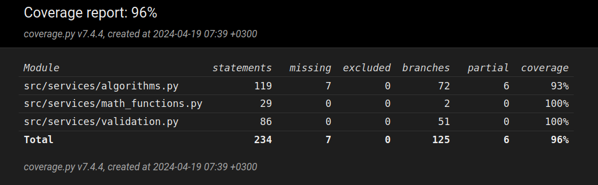

# Sovelluksen testaus

Sovelluksen käyttämät omatekemät matemaattiset funktiot ja Calculator- ja Validator-luokkien funktiot on testattu yksikkötesteillä hyödyntäen unittest-kirjastoa. Calculator- ja Validator-luokkia testataan myös ns. päästä päähän. Käyttöliittymä on jätetty automaattisen testauksen ulkopuolelle. Sovelluksella on 19.4.2024 seuraava testikattavuus:

