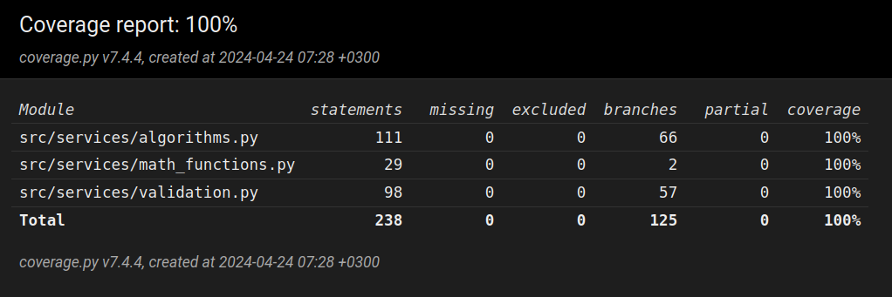

# Sovelluksen testaus

Sovelluksen käyttämät omatekemät matemaattiset funktiot ja Calculator- ja Validator-luokkien funktiot on testattu yksikkötesteillä hyödyntäen unittest-kirjastoa. Kyseisiä luokkia testataan sekä oikeellisilla että virheellisillä syötteillä. Funktioita testataan sekä yksinkertaisilla syötteillä, jotta funktioiden mahdollisesti sisältävät virheet olisi helppo tunnistaa, mutta myös monimutkaisilla syötteillä, jotka simuloivat paremmin sovelluksen käytössä saamia syötteitä. Käyttöliittymä on jätetty automaattisen testauksen ulkopuolelle, sillä käyttöliittymäohjelmointi ei ole kurssin ydinasiaa ja halusin keskittyä enemmän algoritmien kehittämiseen ja niiden testaamiseen. Sovelluksella on 24.4.2024 100 % testikattavuus:

Koska tieteellisen laskimen saamat syötteet ovat lähes aina melko lyhyitä, en kokenut tarpeelliseksi tehdä suorituskykyä mittaavia testejä sovellukselle. Tieteellisen laskimen toteutuksessa algoritmisia haasteita asettaa syötteen validointi, sillä syöte voi sisältää suuren määrän erilaisia virheitä ja niiden tunnistaminen on sovellukselle hankalahkoa. Keskityin siksi syötteen validoinnin ja prosessoinnin testaamiseen. Tästä syystä en myöskään tehnyt vertailua vaihtoehtoisten toteutustapojen kanssa.

### Testisyötteet
Omatekemät matemaattiset funktiot testattiin seuraavien asioiden suhteen:
- Kaikki funktiot palauttavat oikean arvon positiivisilla ja negatiivisilla luvuilla sekä suurilla luvuilla
- Kaikki funktiot palauttavat Decimal('NaN'):n, kun laskutoimitukset laitetaan epäonnistumaan antamalla virheelliset argumentit
- Jakamisfunktio palauttaa Decimal('NaN'):n, kun yritetään jakaa nollalla

Calculator-luokasta testatiin funktiot seuraavasti:
- chars_to_ints
    - Palauttaako funktio yksinkertaisen merkkijonon unicode-lukujen listan
- ints_to_tokens
    - Funktiolle annettiin argumenttina unicode-lukujen listan ja varmistettiin että se palauttaa listan tokenien unicode-lukujen listoja, eli että se tunnistaa tokenit oikein syötteestä
- shunting_yard
    - Palauttaako funktio tyhjän dequen, jos kaarisulkeet eivät täsmää. Funktion toiminta oikeellisilla syötteillä testataan calculate-funktion testauksen yhteydessä, sillä calculate hyödyntää kaikkia muita luokan funktioita
- ints_to_values
    - 
- evaluate_input_in_postfix_notation
    - 
- calculate
    - 

Validator-luokasta testattiin funktiot seuraavasti:
- __init_
    - Asetetaanko argumenttina annetut range:t ja int:t oikein olion muuttujiin
- get_calling_function_name
    - Palauttaako funktio testausfunktion nimen isolla alkukirjaimella, '_':n korvattuna välilyönneillä ja huutomerkillä lopussa
- does_not_compute
    - Tämä validointifunktio on olemassa sellaisia virheitä varten, joita ei olla sovelluksen kehityksessä osattu ennakoida. Siten sitä ei voi myöskään mielekkäästi testata
- numbers_too_large_to_be_computed
    - Funktiolle annetaan argumenttina suuri luku nostettuna suuren luvun potenssiin ja varmistetaan, että funktio palauttaa oman nimensä virheilmoituksena
- division_by_zero_is_undefined
    - 
- unassigned_variables_used
    - Palauttaako funktio "", kun kaikki syötteen muuttujat ovat käytössäolevia muuttujia. Palauttaako funktio oman nimensä virheilmoituksena, jos syöte sisältää muuttujia, jotka eivät ole käytössä
- invalid_use_of_operators
    - Palauttaako funktio oman nimensä virheilmoituksena, jos syötteen ensimmäinen tai viimeinen merkki on operaattori tai jos syötteessä on peräkkäin kaksi operaattoria
- missing_operator
    - Palauttaako funktio "" jos syötteessä on kaarisulkujen sisällä oikeellinen laskutoimitus, tai jos tällaisten kaarisulkuja ennen tai niiden jälkeen on kertolasku. Palauttaako funktio oman nimensä virheilmoituksena, jos syötteestä puuttuu operaattori ennen kaarisulkua tai sellaisen jälkeen
- unknown_function_used
    - 
- invalid_use_of_dot
    - 
- invalid_use_of_functions
    - 
- missing_function
    - 
- missing_function_argument
    - 
- mismatched_parentheses
    - 
- get_evaluation_error
    - 
- get_input_error
    - 

### Testien toistaminen

Automaattiset testit voidaan ajaa komennolla **poetry run invoke test**. Testikattavuusraportti voidaan generoida komennolla **poetry run invoke coverage**.